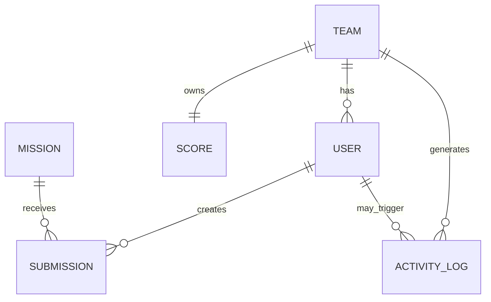

# APP01 — Modelo de Dominio y Datos
## ClubLab v1

**Estado:** FINAL DE DISEÑO  
**Fase:** 4 / Bloque A  
**Implementación:** pendiente  
**Fuente:** D01 + D02 + D03 + Plan Fase 4

---

# 1. Producto

ClubLab v1 representará un dashboard interno de un Club de Programación.

La aplicación mostrará:

```text
participantes;
equipos;
misiones;
entregas;
ranking;
actividad.
```

Su diseño funcional está orientado a que los alumnos puedan investigar la arquitectura de una aplicación web real.

---

# 2. Entidades

```text
Team
User
Mission
Submission
Score
ActivityLog
```

Objetos pedagógicos:

```text
EnvironmentContext
my_team_score
```

---

# 3. Relaciones

```text
Team 1 ── N User
Team 1 ── 1 Score
Team 1 ── N ActivityLog
User 1 ── N Submission
Mission 1 ── N Submission
User 1 ── N ActivityLog
```

---

# 4. ERD



---

# 5. Schemas

```text
app
→ dominio funcional

lab
→ superficie pedagógica controlada
```

Tablas funcionales:

```text
app.teams
app.users
app.missions
app.submissions
app.scores
app.activity_logs
```

Objetos de laboratorio:

```text
lab.environment_context
lab.my_team_score
```

---

# 6. Teams

```text
id            UUID PK
slug          VARCHAR(40) UNIQUE
name          VARCHAR(80)
description   TEXT
created_at    TIMESTAMPTZ
```

---

# 7. Users

```text
id            UUID PK
team_id       UUID FK
username      VARCHAR(40) UNIQUE
display_name  VARCHAR(80)
avatar_key    VARCHAR(80)
role_label    VARCHAR(60)
created_at    TIMESTAMPTZ
```

---

# 8. Missions

```text
id            UUID PK
code          VARCHAR(20) UNIQUE
title         VARCHAR(100)
description   TEXT
difficulty    easy|medium|hard
points        1..500
is_active     BOOLEAN
created_at    TIMESTAMPTZ
```

---

# 9. Submissions

```text
id              UUID PK
user_id         UUID FK
mission_id      UUID FK
status          submitted|approved|rejected
awarded_points  0..500
submitted_at    TIMESTAMPTZ
reviewed_at     TIMESTAMPTZ NULL
```

Restricción:

```text
UNIQUE(user_id, mission_id)
```

---

# 10. Scores

```text
id          UUID PK
team_id     UUID FK UNIQUE
score       INTEGER 0..9999
updated_at  TIMESTAMPTZ
```

`Score` es la fuente autoritativa del ranking.

No se calcula automáticamente desde submissions en v1.

---

# 11. Activity logs

```text
id          BIGSERIAL PK
team_id     UUID FK
user_id     UUID FK NULL
event_type  VARCHAR(40)
message     VARCHAR(180)
created_at  TIMESTAMPTZ
```

Estos eventos pertenecen al producto.

No deben confundirse con los lablogs técnicos de M7.

---

# 12. Ranking

Se deriva de:

```text
app.teams
JOIN
app.scores
```

Orden:

```text
score DESC
team_name ASC
```

Posición:

```text
ROW_NUMBER().
```

---

# 13. Dataset base

Ranking inicial:

| Pos. | Equipo | Score |
|---:|---|---:|
| 1 | Byte Benders | 410 |
| 2 | Runtime Rebels | 355 |
| 3 | Equipo local | 320 |
| 4 | Null Pointers | 275 |
| 5 | Stack Raiders | 190 |
| 6 | Syntax Syndicate | 145 |

El equipo local cambia de nombre según:

```text
team01
team02
...
```

pero inicia siempre en:

```text
320 puntos
posición 3.
```

---

# 14. Usuario local

Usuario principal ficticio:

```text
Avery Morgan
username: avery
role_label: Generalist
```

Equipo local:

```text
Avery Morgan
Lina Park
Mateo Silva
Noor Haddad
```

---

# 15. Misiones del producto

```text
M-101 Primer Pull Request   easy    40
M-102 Bug Hunt             easy    60
M-201 API Sprint           medium  90
M-202 Data Challenge       medium 110
M-301 Demo Day             hard   160
```

Estas misiones pertenecen a la aplicación ficticia.

No son M0–M8 de la clase.

---

# 16. Estado inicial del usuario

```text
M-101 approved
M-102 approved
M-201 approved
M-202 submitted
M-301 available
```

---

# 17. Environment Context

`lab.environment_context` contiene una sola fila:

```text
singleton_id = 1
team_id = equipo local
team_code = teamXX
```

Student:

```text
sin permisos directos.
```

---

# 18. my_team_score

`lab.my_team_score` expone:

```text
team_id
team_name
score
```

solo para el equipo local.

El student recibe:

```text
SELECT
UPDATE(score)
```

No recibe `UPDATE` directo sobre `app.scores`.

---

# 19. Trigger de escritura

La vista utiliza:

```text
INSTEAD OF UPDATE
```

para validar:

```text
team_id no cambia;
team_name no cambia;
score 0..9999;
team coincide con environment_context.
```

Luego actualiza:

```text
app.scores.
```

---

# 20. M4 esperado

Estado inicial:

```text
320 pts
posición 3
```

Ejemplo de modificación:

```sql
UPDATE lab.my_team_score
SET score = 380;
```

Resultado:

```text
380 pts
posición 2.
```

La modificación debe aparecer en:

```text
PostgreSQL;
API;
Frontend.
```

---

# 21. Recover vs Reset

Recover:

```text
arregla scenario;
conserva score modificado.
```

Reset:

```text
recrea seed;
score vuelve a 320;
posición vuelve a 3.
```

---

# 22. ORM

Backend:

```text
TypeORM
```

Regla:

```text
synchronize: false.
```

Schema:

```text
migrations versionadas.
```

Objetos `lab` se pueden crear con migrations SQL explícitas.

---

# 23. Índices

```text
users(team_id)
submissions(user_id)
submissions(mission_id)
scores(score DESC)
activity_logs(team_id, created_at DESC)
```

---

# 24. Dataset esperado por DB

Aproximadamente:

```text
6 teams
9 users
5 missions
7–10 submissions
6 scores
8 activity logs
1 environment context
```

Dataset pequeño y deliberadamente navegable.

---

# 25. Contrato para Backend

Bloque B deberá implementar:

```text
GET /api/health
GET /api/me
GET /api/team
GET /api/ranking
GET /api/missions
GET /api/activity
```

sobre este modelo.

---

# 26. Contrato pedagógico

Antes de M4:

```text
UI score
=
API score
=
app.scores
=
lab.my_team_score
=
320.
```

Después de M4:

```text
UI score
=
API score
=
DB score
=
valor nuevo.
```

Este es el recorrido central de ClubLab #01.

---

# 27. Estado

```text
MODELO DE DOMINIO     ✅ CERRADO
SCHEMA LÓGICO         ✅ CERRADO
DATASET               ✅ CERRADO
VISTA PEDAGÓGICA      ✅ CERRADA
ORM                   ✅ CERRADO
MIGRATIONS            ⏳ Implementación pendiente
SEEDS                 ⏳ Implementación pendiente
TESTS DB              ⏳ Implementación pendiente
```

# APP01 — DISEÑO COMPLETADO